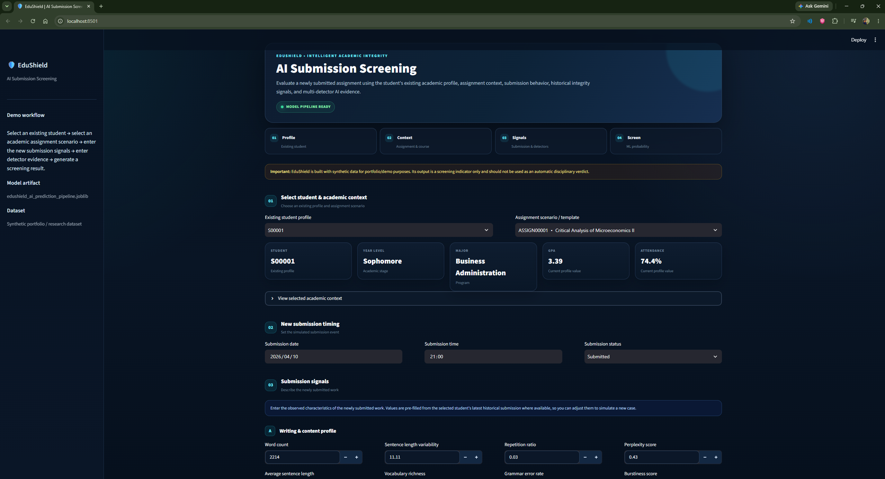
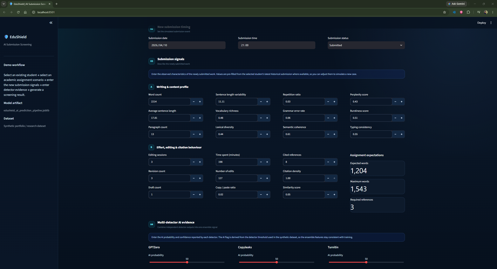
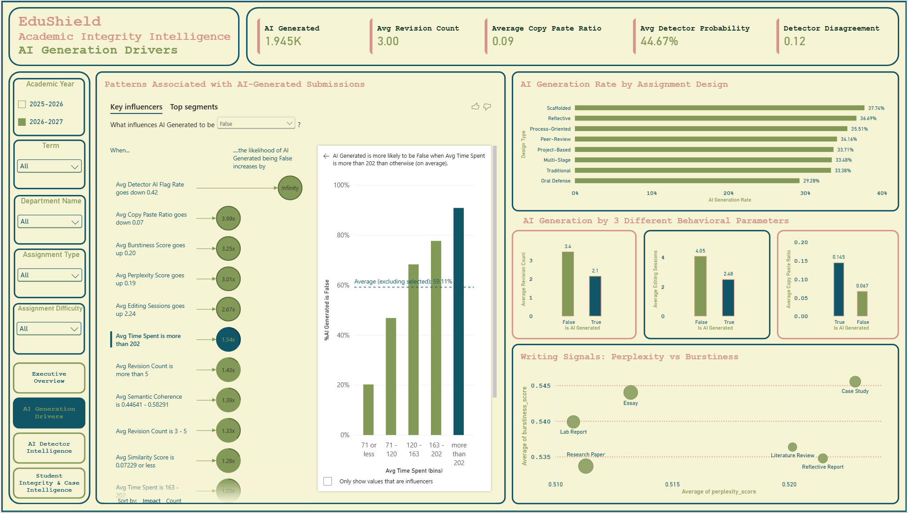
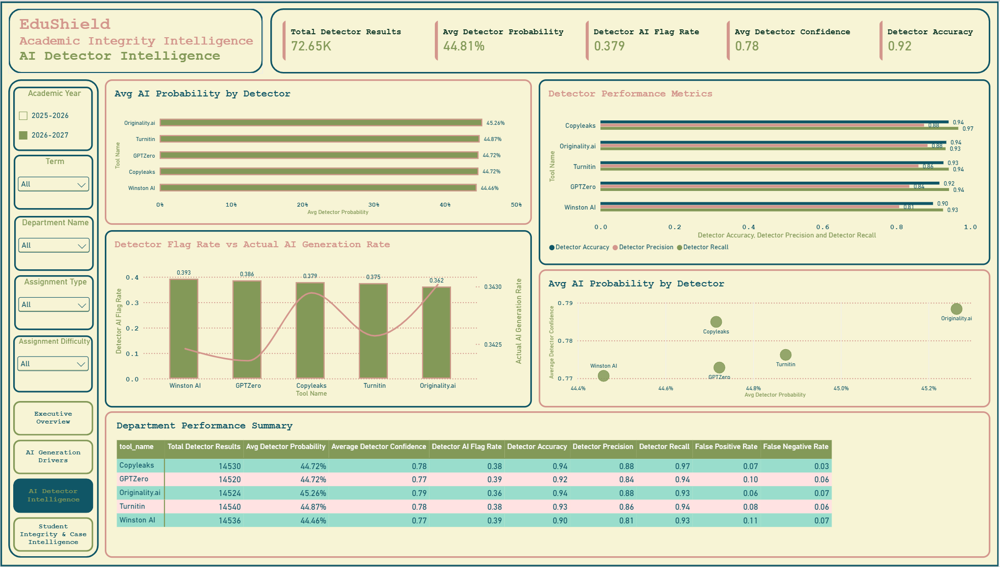

# 🛡️ EduShield — Academic Integrity Intelligence Platform

<p align="center">
  <strong>Detect • Analyze • Investigate • Predict</strong><br>
  A synthetic, end-to-end academic integrity analytics platform combining relational data engineering, machine learning, interactive screening, and Power BI intelligence.
</p>

---

## 📌 Project Overview

**EduShield** is an end-to-end academic integrity analytics project designed to demonstrate how a university-style integrity monitoring workflow can be built from raw relational data through to machine learning predictions and executive analytics.

The project combines:

- **MySQL** for relational storage and structured querying
- **Python / Pandas / NumPy** for data auditing, cleaning, feature engineering, and analysis
- **scikit-learn / XGBoost** for machine learning
- **Streamlit** for an interactive AI-generation screening application
- **Power BI** for multi-page academic integrity analytics and reporting
- **GitHub** for version control and project documentation

> **Important:** EduShield uses **synthetic data** created specifically for this project. It does not contain real student records, real institutional cases, or real disciplinary decisions. The platform is intended for analytics and portfolio demonstration purposes.

---

## 🎯 Project Objectives

EduShield was developed to demonstrate an end-to-end data science and BI workflow capable of:

1. Building a realistic multi-table academic integrity data model.
2. Auditing and cleaning intentionally corrupted datasets.
3. Loading validated data into MySQL.
4. Creating reporting views for BI consumption.
5. Engineering submission-level features for machine learning.
6. Training an AI-generation prediction model without using target leakage.
7. Providing an interactive Streamlit screening application.
8. Comparing multiple synthetic AI detector outputs.
9. Analyzing student behavior and historical integrity signals.
10. Building an executive Power BI dashboard for exploratory and operational analysis.

---

# 🧩 System Architecture

```text
                         ┌──────────────────────────────┐
                         │       Synthetic Dataset      │
                         │    14 Relational CSV Tables  │
                         └──────────────┬───────────────┘
                                        │
                                        ▼
                         ┌──────────────────────────────┐
                         │       Python Data Audit      │
                         │ Cleaning • Validation        │
                         │ Standardization • QA         │
                         └──────────────┬───────────────┘
                                        │
                      ┌─────────────────┴──────────────────┐
                      │                                    │
                      ▼                                    ▼
          ┌──────────────────────┐             ┌──────────────────────┐
          │       MySQL          │             │      ML Dataset      │
          │ 14 normalized tables │             │ Submission-level data│
          │ Constraints & views  │             │ Parquet              │
          └──────────┬───────────┘             └──────────┬───────────┘
                     │                                    │
                     ▼                                    ▼
          ┌──────────────────────┐             ┌──────────────────────┐
          │     Power BI         │             │   ML Training        │
          │ Reporting Views      │             │ scikit-learn/XGBoost │
          │ 4-page Dashboard     │             │ Feature Engineering  │
          └──────────────────────┘             └──────────┬───────────┘
                                                          │
                                                          ▼
                                               ┌──────────────────────┐
                                               │     Streamlit App    │
                                               │ AI Submission Screen  │
                                               │ Probability + Evidence│
                                               └──────────────────────┘
```

---

# 🗃️ Data Model

EduShield uses a normalized relational structure consisting of **14 core tables**.

### Academic & Reference Tables

| Table | Purpose |
|---|---|
| `academic_terms` | Academic year / term definitions and dates |
| `departments` | University departments |
| `majors` | Student majors linked to departments |
| `instructors` | Instructor profiles |
| `students` | Student demographic and academic profile |
| `courses` | Course catalogue |
| `course_offerings` | Course instances offered during specific terms |
| `assignments` | Assignment design, requirements, and AI policy |
| `detector_tools` | AI detector metadata and configuration |

### Activity & Integrity Tables

| Table | Purpose |
|---|---|
| `submissions` | Submission content, timing, writing, and behavioral features |
| `ai_detector_results` | Individual detector outputs for submissions |
| `student_behavior_events` | Post-submission behavioral / integrity events |
| `integrity_cases` | Formal integrity investigation records |
| `student_integrity_history` | Historical integrity snapshots for students |

### Core relational flow

```text
academic_terms
      ↓
course_offerings
      ↓
assignments
      ↓
submissions
      ↓
ai_detector_results
      ↓
student_behavior_events
      ↓
integrity_cases
      ↓
student_integrity_history
```

Supporting relationships connect:

```text
students → majors → departments
courses → departments
course_offerings → courses + terms + instructors
submissions → students + assignments
ai_detector_results → submissions + detector_tools
student_behavior_events → students + courses + submissions
integrity_cases → students + submissions + assignments
student_integrity_history → students
```

---

# 📊 Dataset Scale

The synthetic dataset was designed to provide enough volume for meaningful BI analysis and machine-learning experimentation.

| Dataset | Approx. Records |
|---|---:|
| Students | 1,500 |
| Submissions | 15,000 raw / ~14,983 processed |
| AI Detector Results | 75,000 raw / ~74,561 processed |
| Behavior Events | ~10,000 |
| Integrity Cases | ~1,375 |
| Student Integrity History | 7,500 |
| Academic Terms | 5 |
| Departments | 10 |
| Majors | 24 |
| Instructors | 100 |
| Courses | 90 |
| Course Offerings | 261 |
| Assignments | 800 |
| Detector Tools | 5 |

The integrity history contains five historical snapshots per student.

---

# 🧹 Data Generation, Auditing & Cleaning

The raw synthetic CSVs were intentionally introduced with realistic data-quality issues so the project could demonstrate a complete data-cleaning workflow.

### Issues simulated

- Missing values
- Duplicate records
- Duplicate primary/business keys
- Whitespace inconsistencies
- Category inconsistencies
- Mixed date formats
- Invalid numerical values
- Invalid Boolean representations
- Invalid foreign-key references
- Chronological inconsistencies
- Impossible submission timelines
- Detector timestamps occurring before submissions
- Behavior events occurring before related submissions
- Invalid integrity-case chronology

### Cleaning strategy

The cleaning notebook performs:

- Exact duplicate removal
- Identifier normalization
- Whitespace cleanup
- Category and Boolean normalization
- Primary-key deduplication
- Datetime parsing and recovery
- Invalid timestamp removal
- Submission timeline validation
- Detector timeline validation
- Behavior-event timeline validation
- Integrity-case chronology validation
- Numeric coercion and invalid-value handling
- Contextual missing-value treatment
- Foreign-key validation
- Business-rule validation
- Rebuilding of student integrity history from cleaned upstream data
- Processed-data export to CSV and Parquet

### Main cleaning notebook

```text
notebooks/
└── 01_Data_Audit_and_Cleaning.ipynb
```

---

# 🗄️ MySQL Data Layer

After cleaning, the processed data is loaded into MySQL using a Python loader.

### Database

```text
edushield
```

### SQL workflow

```text
01_create_schema.sql
        ↓
Load processed CSV files
        ↓
02_add_constraints.sql
        ↓
03_post_load_audit.sql
        ↓
04_create_reporting_views.sql
```

### SQL components

| File | Purpose |
|---|---|
| `01_create_schema.sql` | Creates the database and normalized tables |
| `02_add_constraints.sql` | Adds PK/FK/index and integrity constraints |
| `03_post_load_audit.sql` | Performs post-load quality and relationship checks |
| `04_create_reporting_views.sql` | Creates BI-friendly reporting views |

### Python loader

```text
python/
└── load_data.py
```

The loader reads the processed CSVs, normalizes database-facing data types, loads them into MySQL in dependency order, and validates loaded row counts.

---

# 👁️ Reporting Layer for Power BI

Instead of importing all normalized tables directly into Power BI, EduShield exposes reporting views designed around analytical grains.

### Main reporting views

| View | Grain | Purpose |
|---|---|---|
| `vw_submission_analytics` | 1 row / submission | Main submission-level analytical fact |
| `vw_detector_analysis` | 1 row / detector result | Detector comparison and performance |
| `vw_student_integrity_profile` | 1 row / student | Student-level integrity analysis |
| `vw_assignment_analytics` | 1 row / assignment | Assignment and design analysis |
| `vw_integrity_case_analysis` | 1 row / case | Case and investigation analysis |
| `vw_behavior_event_analysis` | 1 row / event | Behavioral event analysis |
| `detector_tools` | 1 row / detector | Detector metadata |

This keeps the Power BI model easier to analyze and avoids unnecessary fact-to-fact ambiguity.

---

# 🤖 Machine Learning Pipeline

The ML task is framed as **submission-level AI-generation prediction**.

### Target

```text
is_ai_generated
```

Each ML row represents one submission.

### Feature groups

The engineered dataset combines:

- Submission timing and behavior
- Writing characteristics
- Assignment design
- Assignment requirements
- Student academic profile
- Course and instructor context
- Multi-detector evidence
- Historical behavior
- Historical integrity snapshots

### Example writing / behavioral features

- Word count
- Sentence length
- Sentence variability
- Vocabulary richness
- Lexical diversity
- Repetition ratio
- Paragraph count
- Grammar error rate
- Citation density
- Semantic coherence
- Perplexity
- Burstiness
- Copy/paste ratio
- Editing sessions
- Revision count
- Draft count
- Time spent
- Typing consistency

### Leakage prevention

The following were excluded from model features where appropriate:

```text
is_ai_generated
ai_generation_source
grade
feedback_score
submission IDs
raw timestamps
current-submission post-outcome behavior
```

Historical information is restricted to information available **before the submission being predicted**, helping prevent future information from leaking into the prediction.

### ML notebook

```text
notebooks/
└── 02_Feature_Engineering_and_Model_Training_FIXED.ipynb
```

### Main ML artifact

```text
models/
└── edushield_ai_prediction_pipeline.joblib
```

### Feature manifest

```text
models/
└── feature_manifest.csv
```

### ML dataset

```text
data/
└── ml/
    └── edushield_submission_ml_data.parquet
```

---

# 🧠 Streamlit Prediction Application

EduShield includes a dedicated interactive screening application.

The application is intentionally focused on **prediction and screening**, rather than functioning as another dashboard.

### Launch

```bash
streamlit run app/app.py
```

### Main capabilities

- Select an existing student
- Select an existing assignment scenario
- Enter a new submission scenario
- Enter writing and behavioral characteristics
- Enter five detector outputs
- Retrieve historical behavior / integrity context
- Run the saved ML pipeline
- Display AI-generation probability
- Display detector consensus
- Display model feature importance
- Export a prediction result as CSV

### Detector inputs

The Streamlit application supports:

- GPTZero
- Copyleaks
- Turnitin
- Originality.ai
- Winston AI

### Application screenshots






---

# 📊 Power BI Dashboard

The Power BI report contains **four analytical pages**.

---

## Page 1 — Executive Overview

### Focus

High-level institutional overview of:

- Submission volume
- AI-generated submission rate
- Student population
- Detector evidence
- Department patterns
- Assignment composition
- Submission trends

### Main analytical sections

- Executive KPI cards
- Submission volume and AI rate trend
- AI generation rate by department
- Submission composition by assignment type
- Detector evidence vs AI-generation rate
- Department performance summary


---

## Page 2 — AI Generation Drivers & Behavioral Signals

### Focus

Explores characteristics associated with AI-generated submissions.

### Main analytical sections

- Key Influencers
- AI rate by assignment design
- Revision behavior
- Copy/paste behavior
- Writing-style signals
- Assignment characteristics

The Key Influencers visual is used as an exploratory association tool and should not be interpreted as proof of causality.



---

## Page 3 — Detector Intelligence

### Focus

Compares the five synthetic AI detectors and their behavior.

### Main analytical sections

- Average detector probability
- Detection flag rate
- Detector accuracy
- Precision
- Recall
- False-positive rate
- False-negative rate
- Detector confidence
- Detector disagreement

The detector-level analysis uses the individual detector-result grain rather than only submission-level averaged detector values.



---

## Page 4 — Student Integrity & Case Intelligence

### Focus

Examines the historical integrity profile of the student population and the investigation/case layer.

### Main analytical sections

- Integrity status distribution
- Average integrity score
- Integrity patterns by academic standing
- Integrity status by department
- Integrity cases by verdict
- Cases by type
- Investigation duration
- Behavioral integrity events
- Student integrity profile


> **Note:** The dashboard is based on synthetic data. Integrity scores, cases, flags, and statuses are analytical demonstration values and are not real disciplinary records.

---

# 📁 Project Structure

```text
EduShield/
│
├── app/
│   └── app.py
│
├── data/
│   ├── raw/
│   │   └── *.csv
│   │
│   ├── processed/
│   │   ├── *.csv
│   │   └── *.parquet
│   │
│   └── ml/
│       └── edushield_submission_ml_data.parquet
│
├── images/
│   ├── App_Images/
│   │   ├── Home_Page.png
│   │   ├── Prediction_Output.png
│   │   └── Values.png
│   │
│   └── Dashboard_Images/
│       ├── Executive_Overview.png
│       ├── AI_Generation_Drivers.png
│       ├── AI_Detector_Intelligence.png
│       └── Student_Integrity_Intelligence.png
│
├── models/
│   ├── edushield_ai_prediction_pipeline.joblib
│   └── feature_manifest.csv
│
├── notebooks/
│   ├── 01_Data_Audit_and_Cleaning.ipynb
│   └── 02_Feature_Engineering_and_Model_Training_FIXED.ipynb
│
├── python/
│   └── load_data.py
│
├── sql/
│   ├── 01_create_schema.sql
│   ├── 02_add_constraints.sql
│   ├── 03_post_load_audit.sql
│   └── 04_create_reporting_views.sql
│
├── .env.example
├── requirements.txt
└── README.md
```

> Rename a dashboard image filename in this section if your final local filename differs from the image folder screenshot.

---

# ⚙️ Installation & Setup

## 1. Clone the repository

```bash
git clone <YOUR_GITHUB_REPOSITORY_URL>
cd EduShield
```

## 2. Create a virtual environment

### Windows

```bash
python -m venv .venv
.venv\Scripts\activate
```

### macOS / Linux

```bash
python3 -m venv .venv
source .venv/bin/activate
```

## 3. Install dependencies

```bash
pip install -r requirements.txt
```

---

# 🔐 Environment Configuration

Create a `.env` file in the project root.

Example:

```env
MYSQL_HOST=localhost
MYSQL_PORT=3306
MYSQL_USER=your_username
MYSQL_PASSWORD=your_password
MYSQL_DATABASE=edushield
```

Do **not** commit the real `.env` file.

Use `.env.example` as the template.

---

# 🛢️ MySQL Setup

Start MySQL and run the SQL scripts in order:

```text
1. 01_create_schema.sql
2. Load processed CSV files using python/load_data.py
3. 02_add_constraints.sql
4. 03_post_load_audit.sql
5. 04_create_reporting_views.sql
```

Then confirm that the main reporting views are available.

---

# 🚀 Running the Streamlit App

From the project root:

```bash
streamlit run app/app.py
```

The application will open in your browser.

The model pipeline is loaded from:

```text
models/edushield_ai_prediction_pipeline.joblib
```

---

# 📈 Power BI Connection

The Power BI report is designed to connect to the MySQL database and use the reporting layer.

Recommended Power BI objects:

```text
vw_submission_analytics
vw_detector_analysis
vw_student_integrity_profile
vw_assignment_analytics
vw_integrity_case_analysis
vw_behavior_event_analysis
detector_tools
```

A dedicated date table can be created inside Power BI for temporal analysis.

### Generic synchronized slicers used across the dashboard

- Academic Year
- Term
- Department
- Assignment Type
- Assignment Difficulty
- Allowed AI Usage (where space permits)

---

# 🧪 Synthetic Detector Layer

EduShield generates five detector result streams per submission.

| Detector | Example Role |
|---|---|
| GPTZero | AI-generation probability and flag |
| Copyleaks | AI-generation probability and flag |
| Turnitin | AI-generation probability and flag |
| Originality.ai | AI-generation probability and flag |
| Winston AI | AI-generation probability and flag |

Detector outputs intentionally include variation, uncertainty, probability, confidence, and disagreement so the dashboard can demonstrate realistic analytical scenarios.

---

# 🔍 Key Analytical Questions

EduShield can be used to explore questions such as:

### Submission analysis

- How frequently are submissions classified as AI-generated?
- How does AI-generation rate vary by department?
- How does AI-generation rate change across assignment types?
- Which assignment characteristics are associated with higher AI-generation rates?

### Behavioral analysis

- How do revision and editing patterns differ?
- How does copy/paste behavior vary between submission groups?
- How do writing-style metrics relate to AI-generation patterns?

### Detector analysis

- How frequently does each detector flag a submission?
- How different are detector probabilities?
- How much do detectors disagree?
- What are the observed false-positive and false-negative rates in the synthetic ground truth?

### Integrity analysis

- What does the student integrity profile look like?
- How are historical integrity events distributed?
- How are cases distributed by type and verdict?
- How do investigation durations vary across case outcomes?

---

# ⚠️ Limitations & Responsible Use

EduShield is a **portfolio / demonstration project** and should not be treated as a production disciplinary system.

### Key limitations

- All student, assignment, submission, detector, and case data is synthetic.
- Detector outputs are simulated rather than live third-party API results.
- Model outputs represent probability estimates, not proof of misconduct.
- Key Influencers highlights associations, not causation.
- Historical integrity variables are synthetic representations.
- The project is designed to demonstrate technical architecture and analytical workflow rather than make real institutional decisions.

### Responsible interpretation

AI-generation probability, detector flags, behavioral indicators, and integrity scores should be treated as **screening signals requiring human review**, not standalone evidence for disciplinary action.

---

# 🔮 Future Enhancements

Potential production-oriented extensions include:

- Live detector API integrations
- Authentication and role-based access
- Secure institutional deployment
- Model monitoring and drift detection
- Student-level longitudinal modeling
- Grouped train/test validation by student
- Explainable AI with SHAP
- Real-time event ingestion
- Automated case-management workflows
- More advanced anomaly detection
- Audit logging
- Role-specific Power BI workspaces
- Cloud deployment

---

# 🛠️ Tech Stack

| Category | Technology |
|---|---|
| Programming | Python |
| Data Processing | Pandas, NumPy |
| Database | MySQL |
| Database Connectivity | SQLAlchemy, PyMySQL |
| Data Quality | Python / Pandas validation |
| ML | scikit-learn, XGBoost |
| Model Persistence | joblib |
| Notebook | Jupyter |
| Visualization | Matplotlib, Seaborn, Plotly |
| Application | Streamlit |
| BI | Microsoft Power BI |
| Configuration | python-dotenv |
| Version Control | Git / GitHub |

---

# 📦 Requirements

Main dependencies include:

```text
pandas
numpy
openpyxl
pyarrow

matplotlib
seaborn
plotly

jupyterlab
notebook
ipykernel

sqlalchemy
pymysql
python-dotenv

scikit-learn
xgboost
joblib

streamlit
```

Install everything using:

```bash
pip install -r requirements.txt
```

---

# 📚 Project Workflow Summary

```text
Synthetic Data Generation
        ↓
Raw Data Audit
        ↓
Data Cleaning & Validation
        ↓
Processed CSV / Parquet
        ↓
MySQL Relational Database
        ↓
Reporting Views
        ↓
        ┌───────────────────────────────┐
        │                               │
        ▼                               ▼
Power BI Analytics                ML Feature Engineering
        │                               │
        ▼                               ▼
4-Page BI Dashboard                Model Training
                                        │
                                        ▼
                                  Saved ML Pipeline
                                        │
                                        ▼
                                  Streamlit App
```

---

# 👤 Author

**Aditya Ujjwal**

Aspiring Data Analyst | Data Science & Analytics Enthusiast

Skills demonstrated in this project include:

`Python` • `SQL` • `MySQL` • `Pandas` • `Machine Learning` • `XGBoost` • `Streamlit` • `Power BI` • `Data Cleaning` • `Feature Engineering`

---

# ⭐ Project Note

EduShield was built as an end-to-end portfolio project to demonstrate how **data engineering, data quality, machine learning, application development, and business intelligence can be combined into one analytical system**.

If you find the project useful, consider giving the repository a ⭐.

---

## 📜 Disclaimer

**EduShield is an educational and portfolio project based on synthetic data. It must not be used to make real academic misconduct, disciplinary, employment, admissions, or other high-impact decisions about individuals.**
